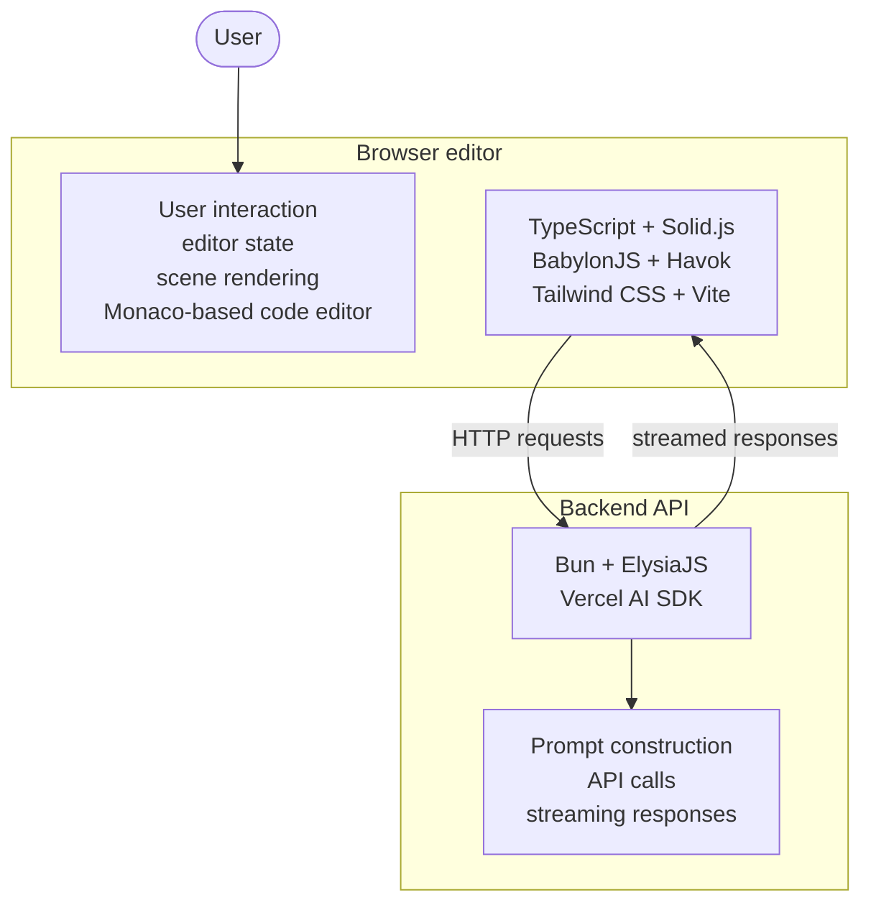

# Slop Engine: Two-Layer SPA

This diagram shows the app as two simple runtime layers: the browser editor and the backend API.

```mermaid
flowchart TB
    U([User])

    subgraph Browser["Browser editor"]
        UI["User interaction<br/>editor state<br/>scene rendering<br/>Monaco-based code editor"]
        FE["TypeScript + Solid.js<br/>BabylonJS + Havok<br/>Tailwind CSS + Vite"]
    end

    subgraph API["Backend API"]
        BE["Bun + ElysiaJS<br/>Vercel AI SDK"]
        AI["Prompt construction<br/>API calls<br/>streaming responses"]
    end

    U --> UI
    FE -->|HTTP requests| BE
    BE -->|streamed responses| FE
    BE --> AI
```
